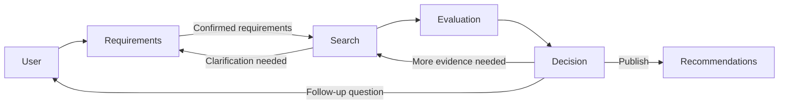

# Architecture

StayLah has a Python backend, a browser interface, and a PostgreSQL database. The backend workflow is called Falcon. It uses LangGraph to collect housing requirements, search external sources, and prepare recommendations.

## Conversation flow

The code and datasets sometimes refer to requirements, search, and evaluation as **A**, **B**, and **C**.

| Component | Responsibility | Code |
| --- | --- | --- |
| Requirements (A) | Parse conversation turns, resolve conflicting requirements, and request confirmation | `property_agent/requirements/` |
| Search (B) | Plan queries, fetch listings, and investigate location, amenities, and travel requirements | `property_agent/search/` |
| Evaluation (C) | Rank candidates, prepare recommendations, and review their evidence | `property_agent/evaluation/` |
| Decision | Choose whether to publish, search again, ask a question, or stop | `property_agent/decision/` |
| Orchestration | Connect the stages and manage conversation turns and resumption | `property_agent/orchestration/` |
| Persistence | Store profiles, messages, runs, recommendations, and favorites | `property_agent/persistence/` |
| Web | Serve the StayLah interface and its JSON API | `web/` |

Shared request and result types are defined in [contracts.py](../property_agent/contracts.py).

## Search

The search entry point is `fulfill_requirements(request, *, ctx)` in [search/api.py](../property_agent/search/api.py). It accepts confirmed requirements and returns a `Result[RequirementFulfillment]` with listings, requirement coverage, and any clarification questions.

Search runs in two phases:

1. Read search pages to collect candidates within the page and candidate limits.
2. Fetch details and investigate missing facts for the collected candidates.

The scheduler selects from tasks allowed by the current phase, available evidence, remaining budget, and deadline. It can use model guidance, but code validates the selected task. Page snapshots and retrieved details are reused within a run.

| Source | Data |
| --- | --- |
| PropertyGuru, through OpenCLI | Listing search pages and property details |
| OneMap | Geocoding, transport facilities, parks, and routes |
| OpenStreetMap | School and supermarket locations |

Source facts and unresolved fields stay attached to the listing as evidence and field issues. A completed lookup does not necessarily mean a requirement is satisfied: a verified 55-minute commute still fails a 40-minute limit. Unsupported or inconclusive checks remain visible in the result.

Amenity searches are bounded and do not establish that every nearby facility has been found. Coordinates may represent a building or campus center rather than an entrance. Default commute queries use public transport at 08:00 on the next queryable weekday in Singapore; explicit user timing takes precedence, and defaults are recorded in the evidence. Static route estimates are not live traffic measurements.

## Recommendations and follow-up

Evaluation scores candidates supplied by search, produces a recommendation draft, and reviews factual claims against the available evidence. It does not independently recheck all hard constraints. In particular, the legacy `screen()` wrapper validates and deduplicates inputs; its `eligible` field is not proof that every condition has been met.

Decision routing also checks cancellation, deadlines, profile versions, review results, and search limits. Requirement changes return to the requirements workflow for confirmation before a new search.

See [Recommendation evaluation](evaluation.md) and [Follow-up integration](clarification-integration.md) for the implementation details.

## State and persistence

PostgreSQL stores application records. LangGraph uses PostgreSQL checkpoints for the requirements and decision graphs. A conversation can contain multiple search runs; `conversation_id` identifies the conversation, while `run_id` identifies a decision run.

The orchestration layer uses client message IDs for idempotency. Checkpoints and business writes are separate transactions, so repositories use stable keys to make replay safe. Database connections and model clients are runtime dependencies, not fields in the shared conversation state.

The web server keeps browser sessions in memory. Persistent conversation data and checkpoints do not provide production authentication or shared web sessions across server instances. See [Web interface and API](../web/README.md).

## Configuration

[runtime.toml](../runtime.toml) holds model settings, search budgets, and timeouts. Credentials and database URLs belong in a local `.env`; [.env.example](../.env.example) lists the supported variables.

Model and source failures can produce partial results. Callers should inspect `status`, `issues`, coverage, and field-level evidence rather than treating a returned result as a fully verified recommendation.
