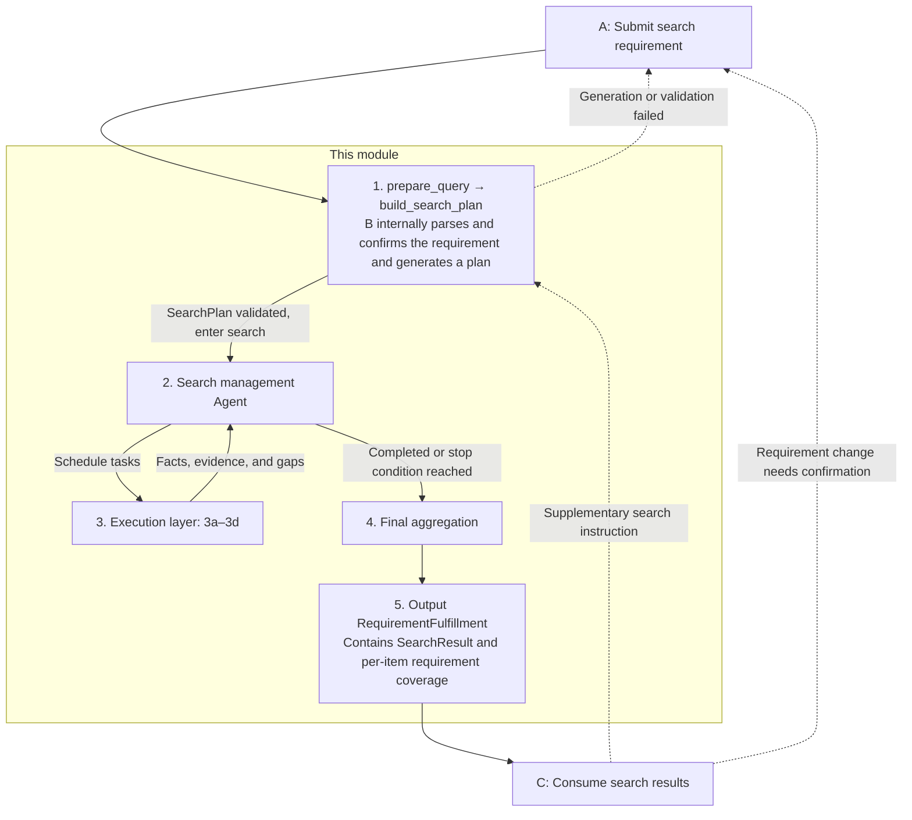

# Current Architecture and Business Flow

For the directory and its purpose, see [Project Directory](../PROJECT_STRUCTURE.md); for the old-to-new numbering mapping, see [Module Mapping Table](../MODULE_MAPPING.md).

Shared contracts are defined solely in `property_agent/contracts.py`. The old numbering and root-directory compatibility files were deleted after the real pipeline passed, and the current code uniformly uses the new paths.

A is responsible for requirement understanding, clarification, and confirmation. B receives the confirmed requirements and plans and executes the real search and investigation.
C ranks, evaluates, and re-checks the evidence for B's candidates; Decision performs publishing, supplementary search, follow-up questions, or termination.
Orchestration manages message idempotency, A/B/C invocation, and session lifecycle. Persistence stores profiles, messages,
runs, recommendations, favorites, and checkpoints. The web page calls orchestration through the original same-origin HTTP interface.

A's requirement clarification and the follow-up questions in the recommendation phase are each retained; C's supplementary search returns to B through integration,
and only when the user needs to change requirements is it handed back to A via clarification. The following expands on B's specific flow.

**Public interface.** A only sends the confirmed requirements, and B completes the internal orchestration; all specific fields are governed by the shared interface.

- `fulfill_requirements(request, *, ctx) → Result[RequirementFulfillment]`
- `prepare_query`, `build_search_plan`, and `search` are retained as B's internal contracts, and A no longer constructs their parameters.

**1. Generate and validate the search plan.** Parse field constraints, regional search terms, and core clarification questions from `RequirementRequest`, then have the model formulate a plan among the legal query options. Internal calls in profile form use `ConversationProfile`. The original requirements are retained in the current LangGraph state and are not lost just because `SearchPlan` can only express some filter conditions. Historical summaries and supplementary search strategies are managed internally by B, which does not relax hard conditions on its own. When core query information is missing, return structured clarification questions to A.

The main flow reuses the already-validated plan, and `search` no longer lists an input validation node separately. Validation of the public interface input, `ctx`, and output required by the contract is handled by the shared interface layer; boundary validation is still performed when `search` is called independently.

**2. Search management Agent.** Schedule 3a property finding according to the plan, and invoke the remaining capabilities as needed; decide whether to continue or end based on the results, without rewriting A's requirements on its own. Reuse existing valid results, and comply with page limits, candidate count limits, and the deadline; when there are no executable tasks, proceed to aggregation.

Scheduling is strictly divided into two phases: search and supplementation. First, only execute 3a's search-page tasks (including reusable pages) to determine the candidate set; only after all executable search tasks have ended are supplementary capabilities such as 3a details and 3b geolocation opened up. The Agent can only choose among legal tasks in the current phase, and phase boundaries are enforced by code. When the search quota is exhausted or the query is blocked, existing candidates may be supplemented, but the marker that the search is incomplete must be retained; if there are no candidates, aggregate directly, and if the overall deadline has arrived, stop all scheduling.

3a pushes expressible hard conditions down to PropertyGuru's website filters (budget upper and lower limits, number of bedrooms, whole-unit/single-room, property category, and unit type); exact bedroom values, ranges, and minimum counts are converted from the original conditions into the website's 0–4 and 5+ buckets, and conditions that cannot be expressed precisely continue to be marked as pending verification. The contract's condo corresponds to the website's two subcategories CONDO and EXCON, while apartment is first narrowed using only the N major category and precise verification is retained. The original Listing conditions are passed through B's internal parameters and do not extend the shared SearchPlan. The same physical page with the same conditions in the same round is read only once, and in-page continuation reads are sliced by quota from the validated full-page snapshot. Before reading details and after details are returned, 2 checks the hard conditions against the existing evidence; candidates that clearly fail are retained for C to verify, but subsequent supplementary checks are stopped. Detail tasks are scheduled only when the user's conditions lack evidence and the guru details can supplement that field, or when a specific map investigation requires an address; conflicts are retained as pending verification, and the same details are not read repeatedly. Task reasons, phases and model latency, actual web page reads, and skip reasons are written to the internal audit log.

The management model receives candidate facts, specific missing fields, and investigation requirement IDs, and chooses the order among the currently legal tasks. When there is only one task, execute it directly; when there are no tasks, end; do not make an extra model call just to choose the sole task. 3a always encapsulates only guru_search's search and detail methods.

**3. Execution layer.** Retain the following four responsibilities; external sources are injected through Providers, and all capabilities share the current round's context and deadline.

| Number | Capability | Responsibility |
| --- | --- | --- |
| 3a | Property search and details | Use `guru_search` to find properties and read listing details, and organize fields and evidence. |
| 3b | Common geolocation capability | Provide standard addresses, coordinates, and geolocation precision for reuse by 3c and 3d. |
| 3c | Amenity requirement investigation | Query nearby facilities and reuse 3b; call 3d when travel distance or duration is needed. |
| 3d | Commute requirement investigation | Reuse 3b to query routes and estimated durations based on origin, destination, transport mode, and time period. |

Supplementary checks are carried out only based on inputs that can be passed through the contract and facts already obtained; when parameters or evidence are missing, retain the gap and do not rely on extra inputs privately cached during the plan generation phase.

2 schedules 3b/3c/3d only when there are supported amenity or commute requirements, and does not add a surrounding overview to every property just because a map Provider is registered. 3c's overview method retains the default parameters of a residence-centered, 1500-meter straight-line radius and five categories: MRT/LRT stations, bus stops, supermarkets, schools, and parks; specific investigations are executed according to requirements. Transport and parks read from OneMap; supermarkets and schools read from OpenStreetMap. Map points or campus centers are not guaranteed to be actual entrances, and a complete source response does not mean real-world facilities are exhaustive. Walking distance/time requirements reuse 3d as needed; when only a limited set of facilities is checked, one cannot claim absolute nearest or confirm that no facility satisfying the conditions exists.

3d defaults to departing from the residence and using public transport at 08:00 on the next queryable Monday to Friday in the Singapore time zone; public holidays on the default day are not verified, and the default values are recorded in the evidence. The mode, date, and time explicitly given by the user take precedence; identifiable arrival deadlines are verified through bounded real route queries, and explicit conditions that cannot be interpreted are reported as pending verification. OneMap driving/walking/cycling returns static route estimates and does not represent real-time morning peak traffic conditions. When the residence geolocation is imprecise, the destination is ambiguous, the call fails, or the quota is exhausted, retain the gap.

The outer graph explicitly hands the original `RequirementRequest` to the search graph through B's internal `search_for_request`. The shared `search(plan, *, ctx)` signature remains unchanged. Module 2 schedules 3c/3d in the supplementation phase, and internal results are written back to the graph state and the original `Listing.evidence`/`field_issues`, without extending the shared Listing. A default commute overview task can also be created when only work/school background is available; when the destination is missing, do not guess the address.

**4. Final aggregation.** Unify fields and units, deduplicate, and organize existing facts, evidence, source coverage, and unresolved items, without dispatching further work. Check Listing conditions one by one, and do not treat unknown or conflicting items as satisfied; retain candidates for C to rank and evaluate. Derived requirements explicitly report completed, unsupported, or unverified; supported commute/amenity requirements are aggregated according to the actual investigation evidence for each candidate, and unimplemented metrics such as environment and administrative district verification continue to be reported as unsupported. Completing an investigation does not equal satisfying a condition: a real commute of 55 minutes can complete the investigation but does not satisfy a 40-minute condition, and the comparison result is handed to C together with the route evidence.

**5. Output to A/C.** Publicly return `Result[RequirementFulfillment]`, containing the original `SearchResult`, requirement coverage, and clarification questions. If the core retrieval is fully completed, completed may be returned; if not completed, partial; only when information blocking the core is missing is needs_clarification returned. Open requirements are fixed at best_effort, and skipped IDs are explicitly reported; even if strength=hard, they do not block the core result and are not downgraded separately. C continues to consume the candidates from the internal SearchResult, and subsequent supplementary searches are invoked on B by Decision through integration; requirement changes are re-confirmed through A.

**Interface boundaries and recovery.** This reorganization does not add shared contract fields and does not change LangGraph node names, state fields,
checkpoint identifiers, interrupt/resume payloads, invocation order, or caching/retry/budget rules.
C's model instances are uniformly stored in evaluation/configuration, and all configuration entry points use the same state.
Source configuration location is clarified through runtime/paths to determine the project root directory; the installation package retains the original built-in default value fallback.
For detailed verification evidence and limitations, see [Acceptance Record](refactoring/acceptance.md).
