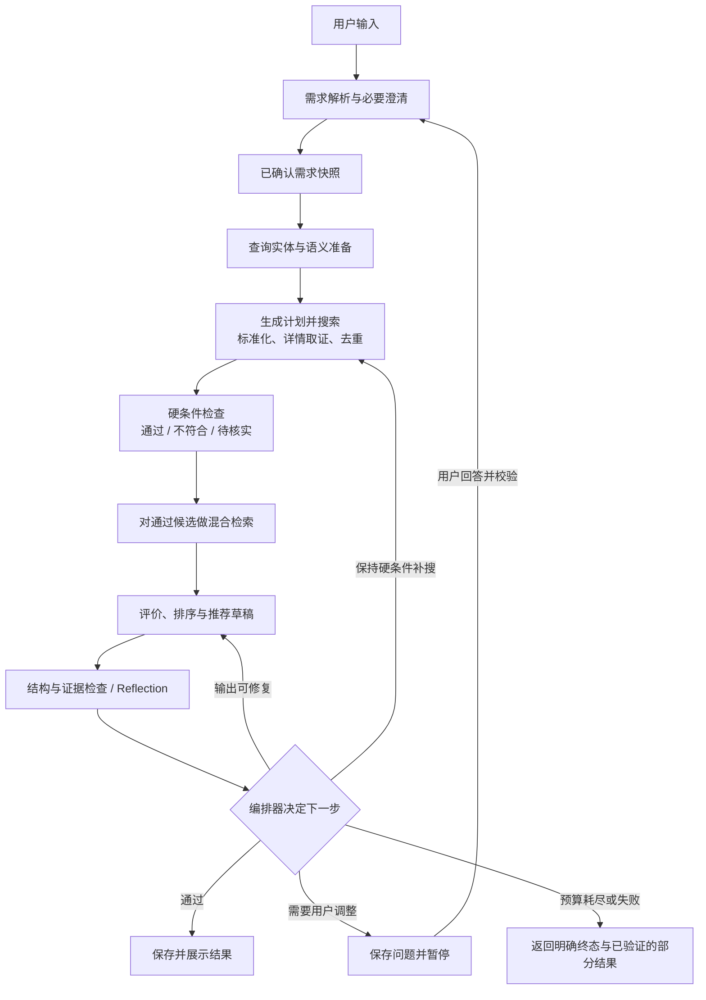

# 第一阶段接口冻结会议准备稿

日期：2026-09-09。状态：供讨论，未冻结、未实现；不代表人员分工已确认。

依据：用户提供的《黑客松项目启动探讨会会议纪要》《hackson文档V0》。本稿聚焦需求解析、搜索、匹配、评价、推荐闭环。已有 architecture 文档记录更早的讨论，本稿不自动替代它们；本次会议批准后再统一基线。

补充材料：[完整函数签名与正常/边界/错误示例](function-contracts-v0.md)、[Python 类型契约](contracts_v0.py)、[37 个完整数据用例](examples/function-contract-cases.json)。函数参数以补充稿为准：evaluate 增加实际房源快照与策略参数，decide_next 接收只读 DecisionState。补充稿的最小字段集合为待确认的评审范围。

## 1. 本次会议要形成的结果

目标：不同成员只看接口文档与共同示例，就能分别实现模块，并知道异常发生时由谁处理。

应形成：共享数据模型、函数签名、字段语义、错误策略、状态与恢复规则、示例输入输出及接口验收清单。人员分配另行记录。

### 需要先统一的五项语义

| 项目 | 现有材料 | 本稿建议，待团队确认 |
|---|---|---|
| 开发模块 | 纪要提出三个主要模块，V0 仍按 A–D 四人描述 | 讨论三组职责：核心编排与数据接入、查询与混合检索、筛选与评价；职责内可由多人协作，函数边界不随人员安排改变 |
| 业务范围 | 材料混用租房与购房语义 | 会议选择一个首版演示范围；本稿示例仅用新加坡租房，不视为产品定位已确定 |
| 数量阈值 | 纪要初步少于 10 条询问；V0 为 0–2、3–10、超过 10 三档 | 用通过硬条件且去重后的候选计数；建议 min_matches=3、display_limit=10；是否提前补搜由独立预算决定 |
| 排序方式 | 早前用户偏好模型综合判断，V0 出现加权评分公式 | 输出有序候选、理由与证据；不强制 total_score。会中明确最终排序政策，检索分数不等于最终推荐分数 |
| 检索范围 | 向量与关键词检索的语料范围尚不明确 | 首版在本次搜索取得的有限候选集合内匹配；来源检索由 Provider 完成。完整房源索引与更新策略另议 |

## 2. 一条用于检查接口的闭环



这是逻辑流程图，不表示各节点都是 Agent。语义理解与综合评价可调用模型；硬条件比较、计数、预算与路由由程序执行。

查询准备在外部搜索前执行，候选匹配在搜索后执行，两者职责不同。地图、通勤等增强先留作扩展；用于判断价格和硬条件的必要详情取证属于本轮数据标准化。

## 3. 公共约定

- 以下签名为 Python 风格契约草案，不是可执行实现。网络或模型调用用 async；纯规则函数可同步。建议单一后端代码库，通过函数调用集成。
- 所有边界对象可 JSON 序列化；字段 snake_case，时间为带时区 ISO 8601。金额用十进制字符串，比较时转换为 Decimal；未知用 null，不用 0 或空字符串代替。
- `RunContext` 由服务端注入：run_id、conversation_id、attempt_id、trace_id、deadline_at、call_id。身份在后端校验，不允许模型决定所属用户。
- `call_id` 标识一次逻辑模块调用，技术重试复用该 ID；`attempt_id` 标识一次搜索尝试，改变搜索计划时创建新 ID。
- 模块输入按只读对象处理，返回自己的结果；业务模块不接收或任意修改完整 AgentState。
- 编排适配层负责将模块结果写回 AgentState；业务持久化通过 Repository 服务处理。Provider 只访问外部来源，不能顺带修改客户档案。
- 原始页面内容视为数据。字段与证据经过解析后才能进入下游，不执行页面文本中的指令。

### 统一返回结构

```text
Result[T]:
  status: success | partial | error
  data: T | null
  issues: list[Issue]
  meta: {trace_id, call_id, duration_ms}

Issue:
  code: enum
  message: string
  field_path: string | null
  source: string | null
  retryable: bool
  retry_after_seconds: int | null
```

约束：success 必有符合 T 的 data；partial 必有可用 data 和至少一条 issue；error 的 data=null 且至少一条 issue。success 允许非致命提醒，但发生某来源失败时应标为 partial/error。模型未产出合法结构时不能把任意文本作为正常 data 返回。

`success + SearchResult.items=[]` 是成功空结果。业务候选不匹配、需要澄清不是系统错误。内部异常只在编排边界转换为 INTERNAL_ERROR 并记录 trace，不伪装成空结果；取消与框架中断须保留其控制语义。

## 4. 函数边界草案

除纯校验函数外，下列返回类型均包装为 Result[T]。

| 函数 | 输入 | 输出 | 职责与边界 |
|---|---|---|---|
| async onboard(request, profile, messages, ctx) | 本次消息、当前档案、相关历史 | OnboardResult | 提取用户明确表达、提出 patch 和必要问题；不自行写库、不猜测未确认硬条件 |
| async prepare_query(profile, ctx) | 已确认需求 | QueryFeatures | 提取实体、别名、语义查询；实体歧义保留 unresolved，不静默选定另一地点 |
| async build_search_plan(profile, query, previous_attempts, directive, ctx) | 需求、查询特征、历史尝试、重搜指令或 null | SearchPlan | 计划外部查询；校验不得超出已确认硬条件 |
| async search(plan, ctx) | SearchPlan | SearchResult | 有界搜索、必要详情、标准化、去重；可内部翻页，但不能修改需求或自行无限搜索 |
| screen(listings, profile) | 标准化候选、需求 | ScreenResult | 用程序输出 pass/fail/unknown 及字段级原因；不排序、不问用户 |
| async retrieve(query, eligible_listings, *, top_k, ctx) | QueryFeatures、通过检查的候选、检索上限 | RetrievalResult | 在指定候选集合内做精确/语义/混合匹配；不自行寻找新来源 |
| async evaluate(profile, retrieval, screen_result, listing_snapshot, coverage, repair_context, *, policy, ctx) | 候选、过滤结果、实际快照、来源覆盖、上次审查问题或 null | EvaluationResult | 输出推荐草稿、证据、取舍和后续建议；不执行重搜、不修改需求 |
| async review(profile, evaluation, listing_snapshot, *, policy, ctx) | 草稿、本轮可信候选证据、展示策略 | ReviewResult | 确定性结构/引用校验及语义 Reflection；返回具体问题，不在内部无限修复 |
| decide_next(state, policy) | DecisionState 只读视图与 RoutingPolicy | RouteDecision | 编排器唯一的路由决策点；执行明确优先级与上限 |

`onboard` 输出交由 ProfileService 校验：用户明确给出的信息可直接形成已确认字段；模型推测和条件放宽建议不能自动转为硬条件。不必要求用户重复确认已经明确说过的预算等信息。

`screen` 和 `decide_next` 返回确定性对象；它们不需要 Result 包装，输入非法属于边界校验失败。所有模块仍可能发生非预期实现异常，由编排层记录并终止当前执行。

### 三组职责的建议映射

| 职责组 | 函数与基础设施 |
|---|---|
| 核心编排与数据接入 | onboard、build_search_plan、search、decide_next；API、状态、Repository、checkpoint 与集成 |
| 查询与混合检索 | prepare_query、retrieve；实体处理、候选索引和融合 |
| 筛选与评价 | screen、evaluate、review；约束判定、推荐、证据与修复问题 |

这些是职责组，不是三项大小相等的工作。核心组仍较大，需拆到节点、Provider、持久化等可验收任务后再分配人员。

## 5. 输入输出字段

本节列出应冻结的字段；可扩展字段不得改变已有字段语义。具体 Pydantic 类型、枚举和样例是会议后第一项落地工作。

| 对象 | 必要字段与含义 |
|---|---|
| UserProfile | profile_id、version、intent(rent/buy)、hard_constraints、preferences、unresolved。每项条件带 field/value/source_message_id；软偏好另有 priority，不自动变为硬条件 |
| OnboardResult | profile_patch、missing_required_fields、questions、ready_for_search；ready 须经程序检查。首版开搜门槛建议交易类型、金额口径、预算、搜索区域或明确“不限区域”、整租/房间等必要范围 |
| QueryFeatures | entities(type/raw_text/canonical_id 或 null)、aliases、semantic_query、unresolved；ID 来自实际词表，不能由模型虚构 |
| SearchPlan | plan_id、profile_version、attempt_id、queries、required_filters、page_limit、candidate_limit、source_mode、reason；source_mode=mock/live 显式指定；每个 query 带 query_id 和来源目标 |
| Listing | listing_key、source、source_listing_id 或 null、source_url、source_mode、title、transaction_type、rental_scope、price、bedrooms、floor_area、location、features、availability、fetched_at、source_updated_at、evidence、field_issues |
| SearchResult | items、coverage；coverage 包含 queried_sources、failed_sources、queries_completed、has_more、truncated、applied_filters、unsupported_filters；完整完成仅指计划内查询，不代表全市场 |
| ScreenResult | eligible、rejected、needs_verification；每条保留 listing_key 和 checks(field/status/reason/evidence_ids)；三类互斥并覆盖所有输入候选 |
| RetrievalResult | candidates、input_count、returned_count、truncated、method_version；候选为 listing_key、exact_matches、vector_score/keyword_score 可空、retrieval_rank、retrieval_score 可空 |
| EvaluationResult | recommendation、assessment；recommendation 包含 ordered_items、summary、limitations；assessment 包含 constraint_findings 和可选 search_directive/relaxation_proposals |
| RecommendationItem | listing_key、rank、reasons、tradeoffs、unknowns；事实型 reason/tradeoff 带 evidence_ids，主观判断明确为判断；不强制 total_score |
| ReviewResult | passed、issues；每项 issue 有 code、listing_key 或 null、field_path、message、severity、suggested_fix；passed 当且仅当没有阻断问题 |
| RouteDecision | action(publish/research/repair/ask_user/finish/stop)、reason_code、search_directive 或 null、pending_question 或 null；finish 可含合法部分结果，stop 表示失败/取消等 |

数量规则依据 `ScreenResult.eligible` 的去重数量，不依据原始网页数量或检索 Top-K 数量。检索裁剪不能让系统误报“只找到 N 套”；展示时区分本次符合数量、进入评价数量、实际展示数量。

### 必须逐字段约定的易错项

- price：`amount/currency/period/scope/status/evidence_ids`。租金 period=month，购房 period=null；scope 区分整套/房间等口径。status=known/unknown/conflict。冲突未解决时 amount=null，原始金额分别保留为证据。
- bedrooms 指卧室数量，不能与 HDB 房型名称中的房间数互换。
- floor_area：`value/unit`，统一 sqm；转换保留来源。未知字段不满足已要求的硬条件，应进入 needs_verification。
- features：采用 true/false/null 三态，例如“未写允许宠物”是 null。
- availability：保留来源声明与 observed_at，不能由抓取成功推断房源已核实可租。
- evidence：`evidence_id/listing_key/field/value/source_url/observed_at/excerpt`；有相同 listing_key 的新观察生成新快照，不能覆盖旧 run 的证据。
- listing_key：优先 source+source_listing_id；缺 ID 时对规范化 URL 生成稳定键。首版只保证来源内去重，跨源疑似重复应标记，不能声称已解决物理房产实体合并。
- unsupported_filters：来源不支持的过滤条件由后端复核；无事实依据时返回 unknown，不能直接视为通过。

### 两种下一步指令必须分开

```text
SearchDirective:
  reason_code: insufficient_candidates | incomplete_coverage
  strategy_changes: list[StrategyChange]
  base_profile_version: int
  evidence_listing_keys: list[string]

StrategyChange（判别联合）:
  {kind: next_page, query_id, cursor}
  | {kind: alias_query, entity_id, alias}
  | {kind: alternate_source, source}

RelaxationProposal:
  proposal_id: string
  field: string
  old_value: JSON
  proposed_value: JSON
  reason: string
  evidence_listing_keys: list[string]
  requires_user_confirmation: true
```

前者改变查找方法，保持业务约束；后者改变用户要求，必须得到用户明确答复。更换别名也须映射到同一地点，不能借查询改写扩大硬限定区域。结果少不一定证明某项约束过严；建议依据本轮被筛除记录并说明有限覆盖。

## 6. 错误、降级和重试

| 情况 | 返回与处理 | 重试责任 |
|---|---|---|
| 查询成功但无房源 | success，items=[]；进入业务数量判断 | 不是技术重试 |
| 必填信息缺失/实体歧义 | OnboardResult 或 QueryFeatures 中列出待澄清项 | 编排器询问用户 |
| 参数或 Schema 不合法 | INVALID_INPUT / INVALID_OUTPUT | 参数修复后再调用，不能原样重复 |
| 暂时超时/服务异常 | TIMEOUT / TEMPORARY_UNAVAILABLE | Provider 内至多 1 次额外重试，受 deadline 限制 |
| 触发限流 | RATE_LIMITED，retry_after_seconds | 能在剩余 deadline 内执行才重试 |
| 认证失败/来源不可访问 | AUTH_REQUIRED / SOURCE_UNAVAILABLE | 本轮不重复；报告来源状态 |
| 一部分来源失败 | partial，合法 items + failed_sources | 可用结果继续，显式报告覆盖不足 |
| 所有来源失败 | error；不得转换成“没有匹配房源” | 终止本轮或按计划选其他来源 |
| 价格冲突/硬字段缺失 | Listing.field_issues；screen=unknown | 必要详情取证仍无法解决则待核实 |
| 模型格式/证据错误 | INVALID_OUTPUT 或 ReviewResult.issues | 编排器统一安排最多 1 次模型修复；与 Reflection 共用修复预算 |
| 预算或最大轮数耗尽 | BUDGET_EXHAUSTED + 明确结束原因 | 不重置计数继续循环 |
| 旧问题回答/并发修改 | STATE_CONFLICT | 返回最新状态，旧回复不覆盖新需求 |
| 业务库/checkpoint 写入失败 | PERSISTENCE_ERROR | 不宣称已保存、可恢复或已完成；记录并返回明确失败 |

建议参数仅用于会议起点：最多 3 次搜索尝试（首次加两次补搜）；每次 search 最多 3 页、60 条规范化候选；检索 Top-K=30；模型修复总计 1 次；单外部调用超时 15 秒；每次用户触发执行的活动时间预算 120 秒。整体取最早到达的上限。最终数值应由团队确认及实测调整。

暂停等待用户不消耗活动时间；恢复分配新的活动 deadline，但保留 run 累计搜索/修复计数。用户明确改变需求可开启新 run，旧 run 标为 superseded 并保留关联。用户主动继续相同需求可新开 run，但系统不能自动新建 run 来规避上限。

初次接入阶段以 Mock 模式开发；真实来源故障不静默切换成 Mock。用户或演示配置明确选择 Mock 时显示模拟数据标记。

## 7. checkpoint、决策点、暂停点

三个概念分别约定：

1. 业务决策点：根据过滤、覆盖、评价和预算判断下一步。
2. checkpoint：保存图执行状态与结果引用，用于后续恢复。
3. 用户暂停点：持久化问题与关联状态，退出本次执行，等待用户回答。

自动补搜是沿条件边创建新 attempt，不是把数据库或 checkpoint 回滚到第一次搜索。已发出的外部调用和已保存业务记录不会自动撤销。

### 建议状态

```text
AgentState:
  schema_version
  run_id, conversation_id, active_attempt_id
  status: running | waiting_user | completed | failed | cancelled | superseded
  profile_snapshot, profile_version
  query_features, search_plan
  attempt_history[]  # 查询指纹、完成状态、返回数量、错误；避免重复相同搜索
  listing_snapshot_refs[], screen_result, retrieval_result
  evaluation_result, review_result
  search_attempts_used, repairs_used, active_deadline_at
  pending_question  # null 或 PendingQuestion
  state_version
  final_result_id

PendingQuestion:
  question_id, reason_code, text
  proposals[], allowed_actions[]
  base_profile_version, state_version
```

大块 HTML、连接对象、API 密钥不放入状态；房源快照保存到业务库，checkpoint 记录可加载引用。历史引用用于复现，不视为最新挂牌。用户等待后继续搜索应重新获取动态字段；不得把等待前旧快照重新标为“刚核验”。

### 关键逻辑保存点

| 保存点 | 必须能恢复的内容 | 恢复后的动作 |
|---|---|---|
| 需求解析/确认后 | 本轮需求版本、待澄清项 | 继续查询准备或等待用户 |
| 一次搜索完成后 | 尝试记录、覆盖状态、不可变房源证据快照引用 | 继续筛选/评价，不凭空清零搜索计数 |
| 评价/审查完成后 | 排序草稿、具体问题、预算 | 执行唯一的下一步路由 |
| 用户暂停前 | question_id、提案、需求版本、状态版本 | 只接收匹配当前问题的回答 |
| 推荐提交后 | final_result_id、终态 | 重放已提交结果，避免重复保存 |

这些是业务上要求恢复的边界，不要求手工实现五套 checkpoint API。若用 LangGraph，由框架 checkpointer 保存图状态，团队负责正确划分节点和持久化业务对象。

### 如采用 LangGraph

- 建议一个找房 run 对应一个 graph thread，thread_id=run_id；conversation_id 对应用户聊天，可包含多个 run。首版同一会话一次只推进一个活动 run。
- 暂停使用 interrupt，恢复使用同一 thread_id 与 Command(resume=...)。从该暂停节点重新执行时，interrupt 前的代码会再次运行，因此把发问、档案写入和结果提交设计成独立、幂等操作。[官方中断文档](https://docs.langchain.com/oss/python/langgraph/interrupts)
- 演示单进程恢复可用持久化 SQLite checkpointer；服务部署可用 PostgreSQL checkpointer。InMemorySaver 只适合无需重启恢复的测试。业务档案数据库与图 checkpoint 的作用不同。[官方持久化文档](https://docs.langchain.com/oss/python/langgraph/persistence)
- 在第一阶段冻结暂停/恢复的业务契约；框架版本与 Saver 依赖锁定后验证 API，不把下述伪签名当作已验证 SDK 代码。

### 对网页暴露的最小交互契约

```text
POST /conversations/{id}/messages
  body: {client_message_id, text}
  -> 202 {run_id, status}

GET /runs/{run_id}
  -> {status, state_version, pending_question, result, issues}

POST /runs/{run_id}/resume
  body: {client_message_id, question_id, expected_state_version,
         action: answer | accept_proposal | decline | cancel,
         answer: string | null, proposal_id: string | null}
  -> 202 {run_id, status}，或 409 STATE_CONFLICT
```

`result` 可以是已审查的部分结果，但须有 partial 标记；未审查草稿不返回为正式推荐。waiting_user 可同时包含合法部分结果与 pending_question。各 action 的必需字段用判别联合校验；accept_proposal 的新值从服务端保存的 proposal 读取，不能让前端直接提交任意 profile_patch。

服务端检查会话/run 归属，并在同一事务中校验版本、占用本次回答、保存消息和待执行任务；同一 client_message_id 重复请求返回原处理结果。后台执行后校验答案语义与需求版本，才继续节点。拒绝放宽时结束并保留已有合法结果，不反复提问。

业务写入与框架 checkpoint 不假定是一个原子事务。为消息、快照批次、最终推荐设置稳定幂等键；如果提交结果后 checkpoint 失败，恢复时先识别已提交结果，不再次插入。首版至少演练这条失败路径。

搜索尝试计数以 Repository 中唯一的 `(run_id, attempt_id)` 记录为准，调用前预占用，恢复时读取同一记录，不因重放增加新 attempt 或清零预算。逻辑调用的技术重试次数也应记录；已保存完整结果的调用可复用其快照，未保存结果的外部请求可能再次发送。因此只能承诺业务记录幂等，不能承诺第三方调用恰好一次。恢复到新活动执行时重新分配 deadline，但保留累计额度。

`finish` 是路由动作，最终状态可为 completed，另用 completion_reason 说明 insufficient_matches、user_declined 等结果；系统故障为 failed。用户暂停状态始终为 waiting_user，不把它当作完成或失败。

## 8. 路由优先级

1. 取消、被新需求取代或状态冲突：停止旧执行。
2. 缺少开搜必需信息：保存问题并 waiting_user。
3. 所有来源不可用：按错误策略处理，不按候选数量建议提高预算。
4. 输出存在阻断性审查问题：额度内修复；用尽后仅保留可验证信息并明确生成失败，不发布问题草稿。
5. 达到已约定的最低有效数量且结果合法：publish；展示上限独立控制。
6. 有效数量不足，但存在未尝试且保持硬条件的计划及额度：research。
7. 数量不足且补搜无路可走：可先保存合法部分结果，再提供有依据的调整建议，waiting_user；没有可解释的建议则 finish。
8. 用户拒绝调整：finish；用户明确调整：更新档案并创建关联的新 run，旧 run superseded。

模型的 next-action 建议须经程序检查，尤其是字段变更、候选 ID 范围、循环预算和查询重复。返回数量、来源覆盖、推荐质量分别判断。

## 9. 用同一组场景进行接口走查

以下均为虚构演示案例；尚未生成可执行 fixtures。

| 场景 | 输入/返回要点 | 预期行为 |
|---|---|---|
| 主流程 | 租整套、月租 SGD 3500、Tampines、至少 2 卧；搜索 12 条，其中 2 条重复、5 条不符合、1 条价格未知、4 条通过 | 去重后 10 条，screen 三类数量 4/5/1；对 4 条匹配、评价并审查；返回合法推荐 |
| 数量边界 | eligible 分别为 0、1、2、3、10、11 | 按确认阈值执行，review 类不凑数，最多展示约定数量 |
| 成功空结果 | success，items=[]，queries_completed=true | 允许有界补搜；不说全市场无房源 |
| 全部失败 | error，TIMEOUT | 显示来源失败，不建议用提高预算“解决”网络错误 |
| 部分失败 | partial，来源 A 有 4 条，来源 B 限流 | 可继续并保留覆盖说明，不宣称来源全部查询成功 |
| 冲突价格 | 展示 3200，正文同口径 3800，无法判定 | price.status=conflict，amount=null，needs_verification |
| 硬条件变更 | 模型建议把 3500 改成 3800 | 输出 proposal 后暂停；未获用户答复不得执行该条件 |
| 中断恢复 | waiting_user 后重启，再回答当前 question_id | 同一 run 恢复，问题与已有结果不丢失 |
| 重复/旧回答 | 同一消息重复发送；旧 question_id；旧 state_version | 重复返回原处理结果，旧状态拒绝，不重复搜索 |
| Reflection | 引用不存在的房源 ID 或写出无证据通勤时间 | 返回具体 issue，最多修复一次，失败不发布草稿 |
| 提交后崩溃 | 推荐业务事务成功、checkpoint 失败 | 恢复识别既有 final_result_id，不重复插入推荐 |

## 10. 建议会议顺序与冻结标准

建议 60–75 分钟：范围与五项语义 10 分钟；沿主场景核对数据与函数 25 分钟；错误和 checkpoint 20 分钟；确认验收与决议 10–20 分钟。时间仅为准备建议，不创建会议或定时任务。

逐个接口检查：

- 调用方与实现方是否相同理解输入字段、单位和空值？
- 输出是否足以让调用方独立决定下一步？
- 谁过滤、谁重试、谁修改状态、谁落库？
- 成功、空结果、部分失败、全部失败是否都有示例？
- 恢复或重复调用是否会重复写入、重复消耗搜索预算？

冻结门槛：共享 Schema 能校验共同样例；每个接口有正常/边界/错误示例；状态迁移、预算、暂停恢复、版本冲突有明确规则；Mock 端到端走查能够指出每个字段的生产方和消费方。

会议记录分为：已通过的契约、待定但阻塞集成的问题、可延后内部实现选择。嵌入模型、具体词表结构、融合算法内部参数可在不改变契约的前提下后定；阈值、字段语义、异常行为与恢复语义需要先定。
