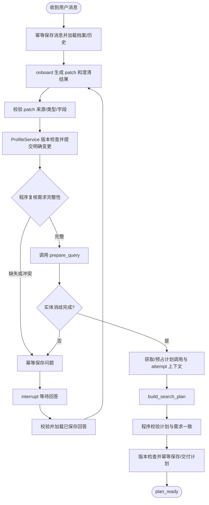

# 模块 A 开发建议：需求交互、档案与聊天、搜索计划

日期：2026-09-13。状态：开发建议，未冻结，未实现。

用户已明确模块 A 边界：与用户反复交互，获取并澄清/修改需求；与用户数据库、chat 数据库交互；最终生成 build_search_plan 的输出。本稿不把 search、screen、retrieve、evaluate、review 和下游 decide_next 的实现划入 A。

依据：[类型契约](contracts_v0.py)、[函数语义与用例](function-contracts-v0.md)、[接口评审稿](interface-freeze-meeting-prep.md)、[业务基线](architecture/pipeline-v1.md)。旧资料与 V0 存在范围/恢复语义差异，下文明确列出建议，不自动改写旧基线。当前运行的服务是计算器教学示例，九个业务函数仍未实现。

## 1. 模块 A 的输入、输出和依赖

A 是一个有状态的需求准备流程。输入为当前用户消息、已授权的用户/客户上下文、会话、当前档案和必要历史；输出是待澄清问题、合法 SearchPlan，或明确错误/取消状态。

| 部分 | A 的工作 |
|---|---|
| 用户交互 | onboard 解析明确表达，追问必要缺失/冲突字段，处理回答和修改 |
| 用户数据 | 通过 ProfileService/Repository 读取并版本化更新 UserProfile |
| 聊天数据 | 幂等保存用户消息、澄清问题和必要助手回复，恢复有序历史 |
| 查询准备 | 获得 prepare_query 的 QueryFeatures；有 unresolved 时返回用户澄清 |
| 搜索规划 | build_search_plan 生成满足已确认条件的计划，并程序校验 |
| 交付 | 保存计划及版本/来源信息，通过接口或事件交给下游搜索执行方 |

prepare_query 是必须明确的依赖：build_search_plan(profile, query, previous_attempts, directive, ctx) 中 query 不能缺失。建议 A 调用查询模块提供的服务，而不是自己复制实体识别/地点词表。该服务若尚未实现，先用严格符合契约的 stub 联调。

A 不执行房源搜索、检索排名或最终推荐。下游如需补搜，将合法 SearchDirective、AttemptSummary 和已分配的 attempt_id 交回 A 的计划服务；补搜次数及是否补搜由下游/共享运行控制层决定。

## 2. 从用户语言到计划的完整路径



图示是正常/澄清路径。非法 patch、模型失败、取消、版本冲突和无法生成合法计划应返回明确状态，不能无界循环。用户明确改变已经用于下游搜索的需求时，交由运行控制层使旧任务 superseded，并以新版本启动新的找房任务。

A 内部需要“继续澄清/准备查询/交付计划”的条件边，但无需调用现有 decide_next：DecisionState/RouteDecision 是搜索评价阶段的业务路由契约，其 action 没有 onboard 或 plan_ready。

## 3. 契约函数与图节点分别做什么

```text
Graph 节点适配器
  从 state 取输入 → 调用业务函数 → 校验 Result → 返回 state 更新

业务服务
  onboard / build_search_plan：输入只读，返回契约，不直接写业务库

持久化服务
  ProfileService / ChatRepository / PlanRepository：版本、幂等、事务
```

例如 onboard_node 读取 request、profile_snapshot 和相关 messages，调用 onboard，保存 OnboardResult；后续 apply_profile_patch_node 才负责校验和提交档案。这保持了 contracts 中“函数不直接写业务库”的约定，同时满足 A 整体负责数据库交互的业务范围。

这张图不需要把全部步骤 bind_tools。模型只参与需求理解、问题措辞和查询策略；读取数据库、应用 patch、检查完整性及最终交付由明确的服务调用完成。

## 4. onboard 与档案更新的实现顺序

1. API/入口服务校验用户对客户和会话的权限，按 client_message_id 幂等保存当前消息。
2. 加载最新 UserProfile 和有序、受限的历史。传给 onboard 的 messages 不重复包含本次 request，即使它刚写入数据库。
3. DeepSeek 输出 OnboardResult：base_profile_version、profile_patch、missing_required_fields、questions、ready_for_search。
4. 运行时校验输出。TypedDict 只描述类型，不替代 Pydantic 或等价校验；先检查结构，再检查业务语义。
5. 只接受白名单字段、合法类型和确实存在的 source_message_id。来源 ID 存在并不能证明表达被正确理解，还需明确的提取规则和固定样例评测。
6. ProfileService 按 base_profile_version 做乐观锁和幂等更新；更新 field_sources；真正发生业务变更才产生新版档案。
7. 程序重新计算 unresolved 和 ready_for_search。模型返回 true 不构成开搜授权。
8. 不完整时只问必要问题；用户明确表达的字段不重复确认。已明确的部分可以先保存，下次从新版继续补齐。

冲突处理示例：“预算 3500，最多也许 4000”应澄清；“把原来 3500 改成 4000”属于明确修改。下游提出的 4000 放宽建议只有经用户接受才能写入档案。

Patch 需要冻结内部应用规则：字段路径白名单、null 是否表示清除、列表覆盖/合并、父子路径冲突，以及重复来源消息的幂等处理。不要把模型输出路径直接当任意数据库字段更新。

初始 locations=[] 与明确不限地区不能混淆：结合 unresolved 和 field_sources 区分。未建模的硬要求（例如当前契约未覆盖的宠物、入住日期、面积）保留为 unresolved 并解释支持范围，不转成“已满足”的软偏好。

## 5. prepare_query 与 build_search_plan

先校验需求可搜索，再调用 prepare_query。地点 ID 应来自词表或查询服务，不接受模型虚构 canonical_id。有歧义时读取 QueryFeatures.unresolved，进入同一个提问流程。

build_search_plan 的前置条件：
- profile.version、query.profile_version、directive.base_profile_version（如有）一致。
- query.unresolved 为空，需求完整。
- ctx.attempt_id 非空，由运行控制层分配；plan 与 ctx 的 source_mode 一致。
- previous_attempts 反映真实已完成尝试，首次可以为空。

建议先实现确定性计划模板，再引入模型生成文本查询和选择允许的策略。required_filters 由已确认档案构造，模型不得自行提高预算或扩大地区。

输出校验：
- required_filters 保持用户硬条件；交易类型、金额、周期、整租/房间口径一致。
- 来源、别名、分页 cursor 可用且在允许范围内。
- page_limit 是整个 search 调用的总页数额度，不是每来源各一份。
- candidate_limit/page_limit 合法且不超过共享运行预算。
- 指纹覆盖来源、规范化查询、cursor 和硬条件；不得重复已完成查询。
- 没有新查询返回 NO_NEW_QUERY，违反硬条件返回 CONSTRAINT_CHANGE_NOT_ALLOWED。

计划合法后再次检查 profile.version，幂等保存不可变计划，并通知下游执行。不得把“计划已生成”展示成“已找到房源”。下游执行前仍须检查任务有效性，因为计划交付后用户可能修改需求。

## 6. 建议的 AState

这是内部设计，不改变 contracts_v0.py 的公共签名。优先只保留跨节点需要的数据。

| 字段 | 内容 | 更新策略 |
|---|---|---|
| schema_version、run_id、conversation_id | 编排身份与版本 | 明确设置；不由模型生成授权信息 |
| phase | collecting / preparing_query / planning / plan_ready / failed / cancelled 等 | 内部流程标识，不复用下游 RouteDecision |
| request | UserMessage | 当前消息覆盖 |
| messages | list[ChatMessage]，受限相关历史 | Repository 重新加载，有序且排除当前 request |
| profile_snapshot | UserProfile | 只在成功提交/重新加载后替换 |
| onboard_result | OnboardResult 或 None | 每轮覆盖 |
| query_features | QueryFeatures 或 None | 档案变化后清空 |
| search_plan | SearchPlan 或 None | 档案变化后清空；交付后可只保留 plan_id |
| previous_attempts、directive | AttemptSummary 列表、SearchDirective 或 None | 外部运行控制层提供，不凭空生成历史 |
| pending_question | PendingQuestion 或 None | 成功消费回答后清空 |
| state_version | 业务并发版本 | 由服务端维护，不等于 checkpoint_id |
| last_issues、last_result_status | 本次错误/降级 | 覆盖；完整历史进事件/调用日志 |
| active_deadline_at、model_calls_used、repairs_used | A 的活动调用预算 | 预占后执行；恢复不清空已用额度 |
| handoff_id / plan_id | 已提交结果引用 | 幂等返回 |

初版可以把 query/profile/plan 小对象放 state；聊天全量保存在业务库，state 仅保留当前使用的上下文。不存数据库连接、API key、模型对象或格式化 prompt。

业务 ChatMessage 使用 message_id/role/text，不是 LangChain BaseMessage。不要直接套 MessagesState；若另存 llm_messages，则显式转换并使用 add_messages。普通列表默认不追加；尤其不能让每次重放都把同一段历史追加一遍。

每次有效 profile 更新后，query_features、search_plan 和旧澄清结论都需重新评估，避免 v2 档案继续使用 v1 计划。

## 7. 数据库与 LangGraph 的分工

用户数据库和 chat 数据库首先是逻辑边界，不必部署为两个数据库服务器；可以在 PostgreSQL 中分表，便于事务一致性。

| 数据 | 负责存储的位置 |
|---|---|
| 用户/客户归属、当前确认需求和版本 | 业务表 + ProfileService |
| 用户消息、助手澄清、消息顺序 | chat/messages 表 |
| pending_question、回答消费、任务与计划交付 | 业务运行记录 |
| 正在执行到哪一步、当前 AState | checkpointer |
| 可选的跨任务语义记忆 | Store；不是核心硬条件的事实来源 |

直接运行自有 worker 时可用 AsyncPostgresSaver；数据库结构初始化和业务表迁移分别管理。若沿用 Agent Server，由它管理 checkpoint，A 仍需要业务 Repository；不要重复配置两套 saver。

即使都用 PostgreSQL，checkpoint 与业务写入也不自动是同一事务。至少保证：
- 用户消息唯一键，重复请求不重复保存。
- patch 按当前消息/逻辑操作 ID 幂等应用，恢复不能重复递增 profile.version。
- 提问按 question_id 幂等保存，不因节点重启重复发问。
- 计划按稳定 handoff/plan 操作键保存，提交成功但 checkpoint 失败时可识别已有交付。
- 业务修改和交付事件尽可能同事务记录；独立下游队列可采用事务 outbox + 消费端幂等。
- 后台恢复时重新检查权限归属、档案版本及取消状态。

## 8. thread、反复澄清与 interrupt

建议 conversation_id 表示长期聊天，run_id 表示一次找房任务；同一任务中 A 的反复澄清使用同一个 thread。独立 A graph 可用稳定映射 thread_id=run_id；若 A 是主图的子图，采用主图 thread 和子图 namespace，不另起无关联的会话。

这与计算器示例“一聊天对应一个 thread”的选择不同，但符合我们学到的 thread 可对应业务任务。旧架构和新接口稿在此有分歧，需要正式统一。

暂停拆成三个边界：
1. prepare_question：生成并幂等保存问题，包含 question_id、base_profile_version、state_version。
2. wait_for_user：执行 interrupt，释放 worker 等待。
3. apply_answer：校验并消费已持久化回答，进入 onboard 或结束。

回答入口先校验归属、question_id、expected_state_version，事务记录回答并入队。恢复使用同一 thread 与 Command(resume=...)。节点开头会重跑，所以 wait 节点中不要在 interrupt 前写消息、改档案或扣额度。参见[官方中断文档](https://docs.langchain.com/oss/python/langgraph/interrupts)。

初次补齐尚未确认的需求可继续当前任务。用户明确修改已交付/执行中的需求时创建关联新任务，旧任务 superseded；需要总编排器协调，A 不能单方面重置下游搜索次数。

普通澄清使用 interrupt/resume 和正常节点更新；update_state 主要用于受控调试/人工修复，不作为绕过 ProfileService 的用户修改入口。

## 9. 错误、预算和待补接口

Result.error 是正常返回值，不会自动触发 RetryPolicy。A 节点适配层必须区分：
- 输入错误：说明具体字段，空消息不调用模型。
- 需求缺失/实体歧义：正常业务结果，提问。
- 模型网络故障：按唯一的有限重试政策处理。
- 非法结构：限定次数的输出修复，不能当作正常 OnboardResult/SearchPlan。
- 版本冲突：加载最新状态，不覆盖用户新需求。
- PERSISTENCE_ERROR：不宣称已保存问题或已交付计划。
- interrupt/取消：保留框架控制语义，不被大范围异常捕获吞掉。

模型 SDK 重试和节点 RetryPolicy 不叠加无界次数；设置 A 独立的活动时限/模型调用预算，人工等待不计活动时间，恢复累计额度不归零。RoutingPolicy 主要面向下游，A 的交互/模型预算需要内部配置，不应假装公共契约已经定义。

实施前需要冻结但不阻止 Mock 开发的事项：
1. 首版买房或租房、开搜必填字段：旧基线买房，fixtures 租房。Mock 先采用后者。
2. prepare_query 的负责人及地点歧义的档案保存规则。
3. run/thread 映射与需求修改后新任务的统一语义。
4. ProfileChange 的 patch 应用规则，以及明确不限/未知的表示。
5. API 恢复输入和对下游交付 envelope：公共文件目前只有函数契约，没有完整交付协议。
6. search attempt 的分配/预占由共享运行控制层负责；A 生成计划不等于已执行一次搜索。

建议新增内部交付对象包含 run_id、conversation_id、profile_version、plan_id、SearchPlan，以及下游后续检索所需 QueryFeatures 的引用；标明这是新增建议，不能悄悄改变 SearchPlan 的公共定义。

## 10. 开发顺序与可验收产物

| 阶段 | 交付 | 验收 |
|---|---|---|
| 1. 契约/数据服务 | 共享运行时模型、ProfileService、ChatRepository、patch 规则 | 现有 onboard/plan 用例可校验；消息幂等、乐观锁、field_sources 正确 |
| 2. A 的 Mock 图 | AState、onboard/prepare_query/plan stub、条件边 | 输入完整需求直接得到合法 SearchPlan；缺预算只追问预算 |
| 3. 多轮交互 | 问题保存、interrupt/resume、修改需求 | 两轮补齐需求；地区歧义继续澄清；旧问题回答拒绝；历史不重复 |
| 4. 持久化恢复 | PostgreSQL 业务服务和 checkpoint、任务入口 | 等待时重启后可回答；patch 不重复提交；计划交付不重复 |
| 5. DeepSeek | 实际 onboard 和 planning 服务、输出校验、限额 | 中英混输、明确修改、冲突、非法模型输出通过固定场景检查 |
| 6. 交接联调 | prepare_query 真服务、计划交付给 search 方 | 版本/attempt/source_mode 一致，计划不放宽硬条件，旧计划不执行 |

先用契约 JSON fixtures 和 fake 依赖验证行为，不要求模型文字逐字等于示例。交付前至少演练：
- 模糊需求 → 澄清 → 完整计划。
- 3500 改为 3000 后计划同步变化，旧 query/plan 失效。
- 明确不限地区与尚未给出地区可区分。
- 宠物等未支持硬要求不会被默默忽略。
- 重复消息、旧回答、并发档案修改。
- 模型虚构地点/提高预算被拒绝。
- 问题保存后重启、档案提交后 checkpoint 失败、计划提交后重复投递。
- 下游补搜指令保持硬条件；无新查询返回 NO_NEW_QUERY。

建议新建 property_agent/onboarding 业务包，保留 deepseek_agent 计算器教学示例。按 state.py / graph.py / nodes.py / services / repositories / prompts / tests 划分。新增包时调整 pyproject 包发现规则，当前仅包含 deepseek_agent*。

第一项具体开发任务：共享模型 + ProfileService/ChatRepository 的假实现 + onboard Mock 节点 + 缺预算 interrupt/resume + 合法 SearchPlan 输出。先让用户的一句话在可观察的 state 中流转，再接真实模型与数据库。

本稿仅完成开发梳理，没有修改 contracts、实现业务函数、调用付费模型或部署数据库。
