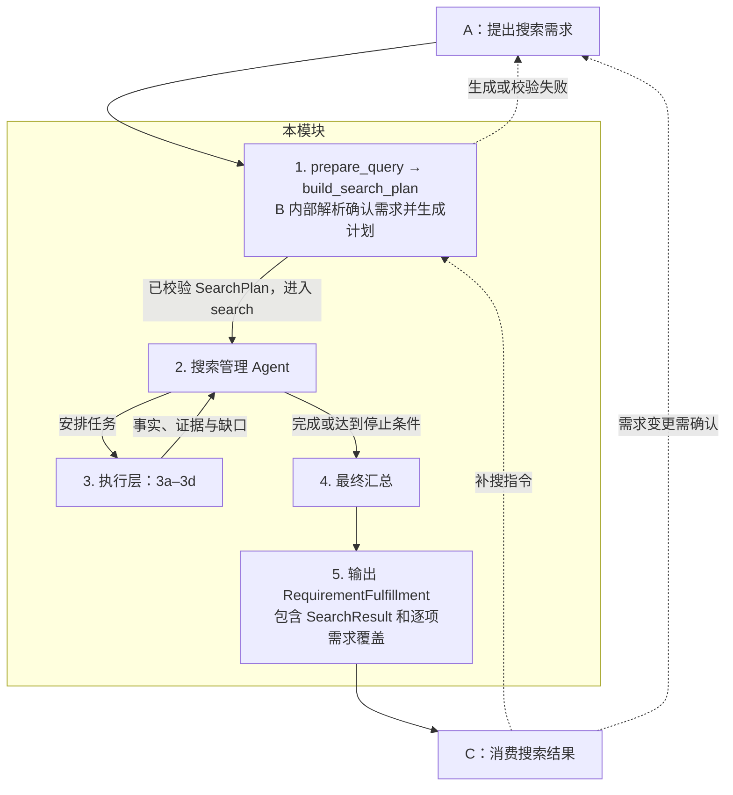

# 当前模块设计

本文说明实际运行边界；原编号到新目录的对应关系只维护在 [模块对应表](模块对应表.md)。
共享契约唯一定义在 `property_agent/contracts.py`。旧编号和根目录兼容文件已在真实链路通过后删除，现用代码统一使用新路径。

A 负责需求理解、澄清与确认。B 接收确认后的需求，规划并执行真实搜索及调查。
C 对 B 的候选排序、评估并复核证据；Decision 执行发布、补搜、追问或结束。
Orchestration 管理消息幂等、A/B/C 调用和会话生命周期。Persistence 保存画像、消息、
运行、推荐、收藏和 checkpoint。网页通过原来的同源 HTTP 接口调用编排。

A 的需求澄清与推荐阶段的追问分别保留；C 的补搜通过 integration 回到 B，
需要用户改变需求时才经 clarification 交回 A。以下展开 B 的具体流程。

**公开接口。** A 只发送确认后的需求，由 B 完成内部编排；所有具体字段以共享接口为准。

- `fulfill_requirements(request, *, ctx) → Result[RequirementFulfillment]`
- `prepare_query`、`build_search_plan`、`search` 保留为 B 内部契约，A 不再构造其参数。

**1. 生成并校验搜索计划。** 从 `RequirementRequest` 解析字段约束、地区检索词与核心澄清问题，再由模型在合法查询选项中制定计划。画像形式的内部调用使用 `ConversationProfile`。原始需求保留在当前 LangGraph 状态中，不因 `SearchPlan` 只能表达部分过滤条件而丢失。历史摘要与补搜策略由 B 内部管理，不自行放宽硬条件。缺少核心查询信息时向 A 返回结构化澄清问题。

主流程复用已校验的计划，`search` 内不再单列输入校验节点。契约要求的公开接口输入、`ctx` 与输出校验由共享接口层承担；独立调用 `search` 时仍执行边界校验。

**2. 搜索管理 Agent。** 根据计划安排 3a 找房，按需调用其余能力；根据结果决定继续或结束，不自行改写 A 的需求。复用已有有效结果，遵守页数、候选数上限及截止时间；无可执行任务时进入汇总。

调度严格分为搜索和补充两个阶段：先仅执行 3a 的搜索页任务（含可复用页面），确定候选集合；所有可执行搜索任务结束后，才开放 3a 详情和 3b 定位等补充能力。Agent 只能在当前阶段的合法任务中选择，阶段边界由代码强制保证。搜索额度耗尽或查询受阻时可以补充已有候选，但必须保留搜索未完成的标记；没有候选直接汇总，总截止时间已到则停止全部调度。

3a 将可表达的硬条件下推到 PropertyGuru 的网站筛选（预算上下限、卧室数、整租/单间、物业类别及房型）；卧室精确值、区间和最少数量按原始条件转换为网站的 0–4、5+ 桶，不能精确表达的条件继续标记待核实。契约 condo 对应网站 CONDO 与 EXCON 两个子类别，apartment 仅先用 N 大类缩小并保留精确核实。原始 Listing 条件通过 B 内部参数传递，不扩展共享 SearchPlan。同轮同条件同物理页只读取一次，页内续取从经校验的整页快照按额度切片。2 在读取详情前和详情返回后，依据现有证据检查硬条件；明确失败的候选保留供 C 核对，但停止后续补查。只有用户条件缺少证据且 guru 详情能补充该字段，或具体地图调查需要补地址时，才安排详情任务；冲突保留为待核实，不反复读取相同详情。任务原因、阶段和模型耗时、实际网页读取和跳过原因写入内部审计日志。

管理模型收到候选事实、具体缺失字段和调查需求 ID，在当前合法任务中选择顺序。只有一个任务时直接执行，无任务时结束；不为选择唯一任务额外调用模型。3a 始终仅封装 guru_search 的搜索和详情方法。

**3. 执行层。** 保留以下四项职责，外部来源通过 Provider 注入，各能力共享本轮上下文和截止时间。

| 编号 | 能力 | 职责 |
| --- | --- | --- |
| 3a | 房源搜索与详情 | 使用 `guru_search` 查找房源、读取挂牌详情，整理字段与证据。 |
| 3b | 公共定位能力 | 提供标准地址、坐标和定位精度，供 3c、3d 复用。 |
| 3c | 配套需求调查 | 查询周边设施，复用 3b；需要路程或耗时时调用 3d。 |
| 3d | 出行需求调查 | 复用 3b，根据起终点、交通方式和时段查询路线及预计耗时。 |

补查仅依据契约可传递的输入与已取得的事实开展；缺参数或证据时保留缺口，不依赖计划生成阶段私下缓存的额外输入。

2 仅在有受支持的配套或通勤需求时安排 3b/3c/3d，不因已注册地图 Provider 就给每套房源补充周边概览。3c 的概览方法保留以住宅为中心、1500 米直线半径及地铁/轻轨站、公交站、超市、学校、公园五类的默认参数；具体调查按需求执行。交通和公园读取 OneMap；超市和学校读取 OpenStreetMap。地图点位或校园中心不保证是实际入口，完整来源响应也不代表现实世界设施无遗漏。步行距离/时间需求按需复用 3d；只检查有限设施时，不能宣称绝对最近或确认没有满足条件的设施。

3d 默认从住宅出发，使用新加坡时区下一个可查询的周一至周五 08:00 公共交通；默认日未核验公共假日，默认值记录在证据中。用户明确给出的方式、日期、时刻优先；可识别的到达期限通过有界真实路线查询验证，不能解释的显式条件报告待核实。OneMap 驾车/步行/骑行返回静态路线估时，不表示实时早高峰路况。住宅定位不精确、目标歧义、调用失败或额度耗尽时保留缺口。

外层图通过 B 内部 `search_for_request` 将原始 `RequirementRequest` 显式交给搜索图。共享 `search(plan, *, ctx)` 签名不变。模块 2 在补充阶段安排 3c/3d，内部结果回写图状态与原有 `Listing.evidence`/`field_issues`，不扩展共享 Listing。仅有工作/学校背景时也可创建默认通勤概览任务；缺少目的地不猜测地址。

**4. 最终汇总。** 统一字段与单位、去重，整理已有事实、证据、来源覆盖和未解决项，不再派工。逐条核对 Listing 条件，未知或冲突不当作满足；保留候选供 C 排序与评估。派生需求明确报告完成、不支持或未核实；支持的通勤/配套需求依照每套候选的实际调查证据汇总，环境与行政区核验等未实现指标继续报告不支持。调查完成不等于条件满足：真实通勤 55 分钟可以完成调查，但不满足 40 分钟条件，比较结果与路线证据一起交给 C。

**5. 输出给 A/C。** 公开返回 `Result[RequirementFulfillment]`，内含原有 `SearchResult`、需求覆盖和澄清问题。核心检索完整完成可返回 completed；未完成则 partial；缺少阻断核心的信息才 needs_clarification。开放需求固定 best_effort，跳过时明确报告 ID，即使 strength=hard 也不阻断核心结果、不单独降级。C 继续消费内部 SearchResult 的候选，后续补搜由 Decision 经 integration 调用 B；需求变更经 A 重新确认。

**接口边界与恢复。** 本次整理不增加共享契约字段，不改变 LangGraph 节点名、状态字段、
checkpoint 标识、interrupt/resume 载荷、调用顺序及缓存/重试/预算规则。
C 的模型实例统一保存在 evaluation/configuration，所有配置入口使用同一份状态。
源码配置定位通过 runtime/paths 明确项目根目录；安装包保留原来的内置默认值回退。
详细验证证据与限制见 [验收记录](docs/refactoring/acceptance.md)。
