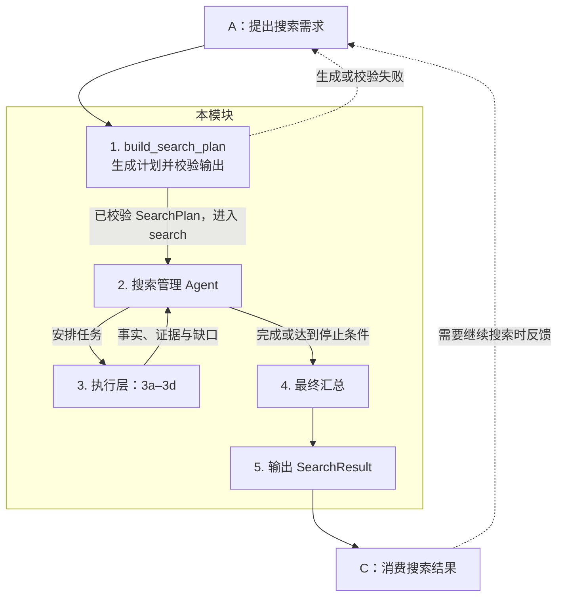

**模块职责。** 接收 A 的搜索需求，生成并校验搜索计划，执行搜索，将结果交给 C。C 需要继续搜索时先反馈给 A，由 A 重新提出需求。本版仅确定职责与流程，具体实现后续细化，以 `contracts_v0.py` 为准。

**公开接口。** 保留以下签名，由编排层串联两个函数并将搜索结果交给 C；搜索需求始终来自 A。

- `build_search_plan(profile, query, previous_attempts, directive, *, ctx) → Result[SearchPlan]`
- `search(plan, *, ctx) → Result[SearchResult]`

**1. 生成并校验搜索计划。** `build_search_plan` 根据 A 提供的画像、查询特征、历史摘要和可选补搜指令生成 `SearchPlan`，校验输出后进入搜索，不自行放宽硬条件。计划生成或校验失败时返回问题给 A，不进入执行层。`prepare_query` 不属于本模块。

主流程复用已校验的计划，`search` 内不再单列输入校验节点。契约要求的公开接口输入、`ctx` 与输出校验由共享接口层承担；独立调用 `search` 时仍执行边界校验。

**2. 搜索管理 Agent。** 根据计划安排 3a 找房，按需调用其余能力；根据结果决定继续或结束，不自行改写 A 的需求。复用已有有效结果，遵守页数、候选数上限及截止时间；无可执行任务时进入汇总。

**3. 执行层。** 仅保留以下四项职责，定位、配套和出行能力的具体接入方式留到开发时细化。

| 编号 | 能力 | 职责 |
| --- | --- | --- |
| 3a | 房源搜索与详情 | 使用 `guru_search` 查找房源、读取挂牌详情，整理字段与证据。 |
| 3b | 公共定位能力 | 提供标准地址、坐标和定位精度，供 3c、3d 复用。 |
| 3c | 配套需求调查 | 查询周边设施，复用 3b；需要路程或耗时时调用 3d。 |
| 3d | 出行需求调查 | 复用 3b，根据起终点、交通方式和时段查询路线及预计耗时。 |

补查仅依据契约可传递的输入与已取得的事实开展；缺参数或证据时保留缺口，不依赖计划生成阶段私下缓存的额外输入。

**4. 最终汇总。** 统一字段与单位、去重，整理已有事实、证据、来源覆盖和未解决项，不再派工。

**5. 输出给 C。** 返回符合现有契约的 `Result[SearchResult]`，由编排层交给 C；包含房源条目、覆盖情况及问题，区分成功、部分完成与失败。完整搜索无匹配可成功返回空列表。C 不直接向本模块下达补搜任务，后续搜索统一走 `C → A → 本模块`。

**接口边界。** 不增加 v0 之外的字段，不承诺当前接口无法表达的定向调查。状态结构、缓存、重试、预算算法和具体框架实现留到开发时细化。
