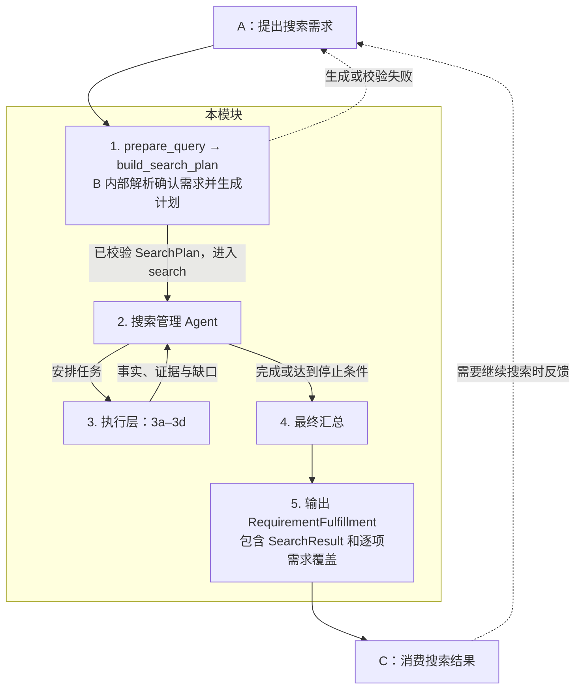

**模块职责。** 接收 A 的搜索需求，生成并校验搜索计划，执行搜索，将结果交给 C。C 需要继续搜索时先反馈给 A，由 A 重新提出需求。本版仅确定职责与流程，具体实现后续细化，以 `contracts_v0.py` 为准。

**公开接口。** A 只发送确认后的需求，由 B 完成内部编排；所有具体字段以共享接口为准。

- `fulfill_requirements(request, *, ctx) → Result[RequirementFulfillment]`
- `prepare_query`、`build_search_plan`、`search` 保留为 B 内部契约，A 不再构造其参数。

**1. 生成并校验搜索计划。** 从 `RequirementRequest` 解析字段约束、地区检索词与核心澄清问题，再由模型在合法查询选项中制定计划。画像形式的内部调用使用 `ConversationProfile`。原始需求保留在当前 LangGraph 状态中，不因 `SearchPlan` 只能表达部分过滤条件而丢失。历史摘要与补搜策略由 B 内部管理，不自行放宽硬条件。缺少核心查询信息时向 A 返回结构化澄清问题。

主流程复用已校验的计划，`search` 内不再单列输入校验节点。契约要求的公开接口输入、`ctx` 与输出校验由共享接口层承担；独立调用 `search` 时仍执行边界校验。

**2. 搜索管理 Agent。** 根据计划安排 3a 找房，按需调用其余能力；根据结果决定继续或结束，不自行改写 A 的需求。复用已有有效结果，遵守页数、候选数上限及截止时间；无可执行任务时进入汇总。

调度严格分为搜索和补充两个阶段：先仅执行 3a 的搜索页任务（含可复用页面），确定候选集合；所有可执行搜索任务结束后，才开放 3a 详情和 3b 定位等补充能力。Agent 只能在当前阶段的合法任务中选择，阶段边界由代码强制保证。搜索额度耗尽或查询受阻时可以补充已有候选，但必须保留搜索未完成的标记；没有候选直接汇总，总截止时间已到则停止全部调度。

**3. 执行层。** 保留以下四项职责，外部来源通过 Provider 注入，各能力共享本轮上下文和截止时间。

| 编号 | 能力 | 职责 |
| --- | --- | --- |
| 3a | 房源搜索与详情 | 使用 `guru_search` 查找房源、读取挂牌详情，整理字段与证据。 |
| 3b | 公共定位能力 | 提供标准地址、坐标和定位精度，供 3c、3d 复用。 |
| 3c | 配套需求调查 | 查询周边设施，复用 3b；需要路程或耗时时调用 3d。 |
| 3d | 出行需求调查 | 复用 3b，根据起终点、交通方式和时段查询路线及预计耗时。 |

补查仅依据契约可传递的输入与已取得的事实开展；缺参数或证据时保留缺口，不依赖计划生成阶段私下缓存的额外输入。

3c 默认以住宅为中心查询 1500 米直线半径内的地铁/轻轨站、公交站、超市、学校及公园。交通和公园读取 OneMap；超市和学校读取 OpenStreetMap。地图点位或校园中心不保证是实际入口，完整来源响应也不代表现实世界设施无遗漏。步行距离/时间需求按需复用 3d；只检查有限设施时，不能宣称绝对最近或确认没有满足条件的设施。

3d 默认从住宅出发，使用新加坡时区下一个可查询的周一至周五 08:00 公共交通；默认日未核验公共假日，默认值记录在证据中。用户明确给出的方式、日期、时刻优先；可识别的到达期限通过有界真实路线查询验证，不能解释的显式条件报告待核实。OneMap 驾车/步行/骑行返回静态路线估时，不表示实时早高峰路况。住宅定位不精确、目标歧义、调用失败或额度耗尽时保留缺口。

外层图通过 B 内部 `search_for_request` 将原始 `RequirementRequest` 显式交给搜索图。共享 `search(plan, *, ctx)` 签名不变。模块 2 在补充阶段安排 3c/3d，内部结果回写图状态与原有 `Listing.evidence`/`field_issues`，不扩展共享 Listing。仅有工作/学校背景时也可创建默认通勤概览任务；缺少目的地不猜测地址。

**4. 最终汇总。** 统一字段与单位、去重，整理已有事实、证据、来源覆盖和未解决项，不再派工。逐条核对 Listing 条件，未知或冲突不当作满足；保留候选供 C 筛选。派生需求明确报告完成、不支持或未核实；支持的通勤/配套需求依照每套候选的实际调查证据汇总，环境与行政区核验等未实现指标继续报告不支持。调查完成不等于条件满足：真实通勤 55 分钟可以完成调查，但不满足 40 分钟条件，比较结果与路线证据一起交给 C。

**5. 输出给 A/C。** 公开返回 `Result[RequirementFulfillment]`，内含原有 `SearchResult`、需求覆盖和澄清问题。核心检索完整完成可返回 completed；未完成则 partial；缺少阻断核心的信息才 needs_clarification。开放需求固定 best_effort，跳过时明确报告 ID，即使 strength=hard 也不阻断核心结果、不单独降级。C 继续消费内部 SearchResult 的候选，后续搜索统一走 `C → A → 本模块`。

**接口边界。** 不增加 v0 之外的字段，不承诺当前接口无法表达的定向调查。状态结构、缓存、重试、预算算法和具体框架实现留到开发时细化。
